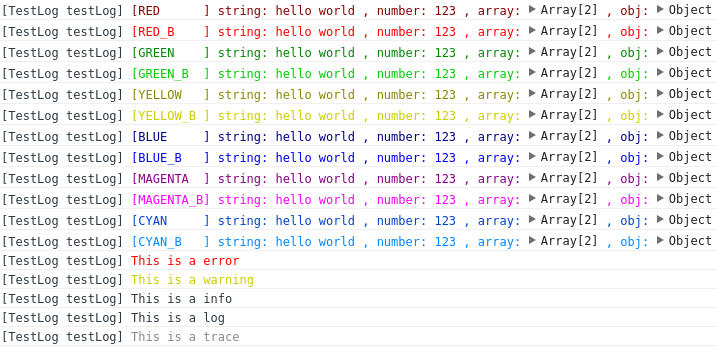
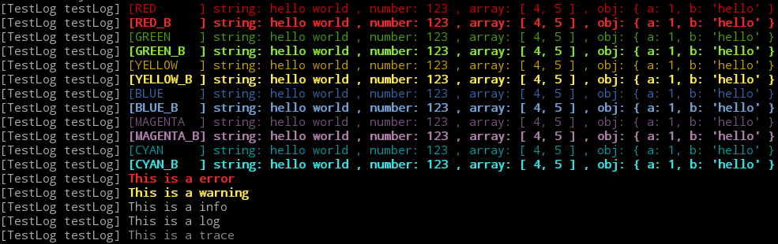

# cpclog.js

A cross platform(node and webpacked-browser) colorful log for js.

# Install

    npm install cpclog.js

# Usage

    const Logger = require('../index.js');

    const logger = Logger.createWrapper('TestLog', Logger.LEVEL_TRACE);

    function testLog() {
        let segments = ['string:', 'hello world', ', number:', 123, ', array:', [4, 5], ', obj:', {a: 1, b: 'hello'}];

        // With color
        logger.info(Logger.RED         , '[RED      ]', ...segments);
        logger.info(Logger.RED_B       , '[RED_B    ]', ...segments);
        logger.info(Logger.GREEN       , '[GREEN    ]', ...segments);
        logger.info(Logger.GREEN_B     , '[GREEN_B  ]', ...segments);
        logger.info(Logger.YELLOW      , '[YELLOW   ]', ...segments);
        logger.info(Logger.YELLOW_B    , '[YELLOW_B ]', ...segments);
        logger.info(Logger.BLUE        , '[BLUE     ]', ...segments);
        logger.info(Logger.BLUE_B      , '[BLUE_B   ]', ...segments);
        logger.info(Logger.MAGENTA     , '[MAGENTA  ]', ...segments);
        logger.info(Logger.MAGENTA_B   , '[MAGENTA_B]', ...segments);
        logger.info(Logger.CYAN        , '[CYAN     ]', ...segments);
        logger.info(Logger.CYAN_B      , '[CYAN_B   ]', ...segments);

        // With level
        logger.error('This is a error');
        logger.warn('This is a warning');
        logger.info('This is a info');
        logger.debug('This is a log');
        logger.trace('This is a trace');
    }

    testLog();

# Demo

In browser:

In node:

